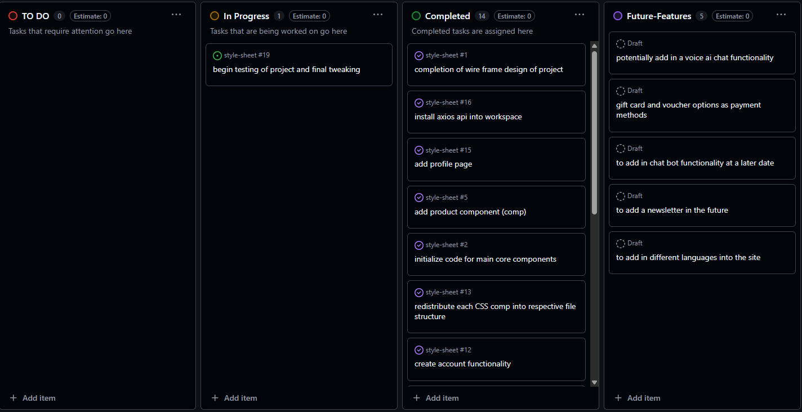
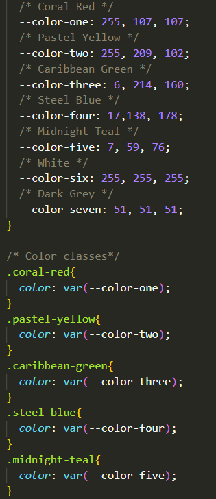
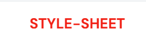
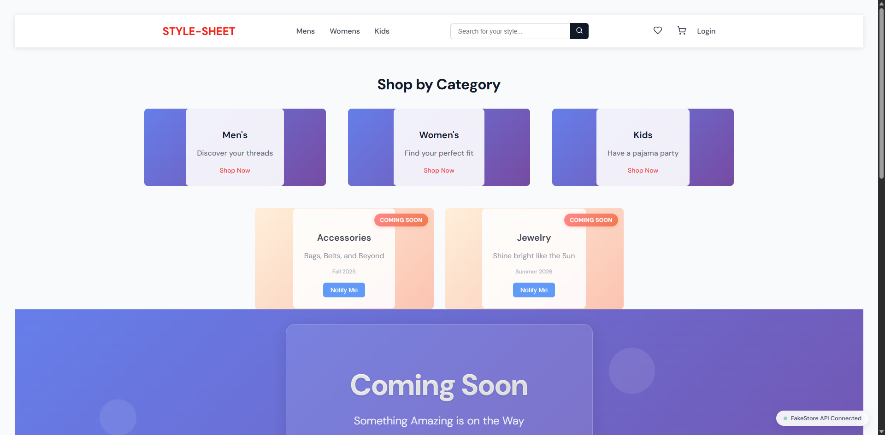
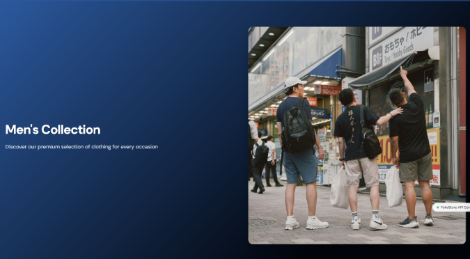
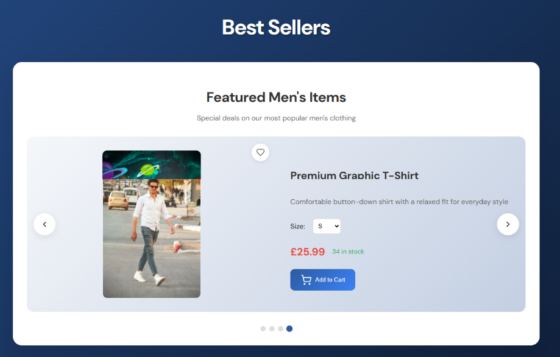
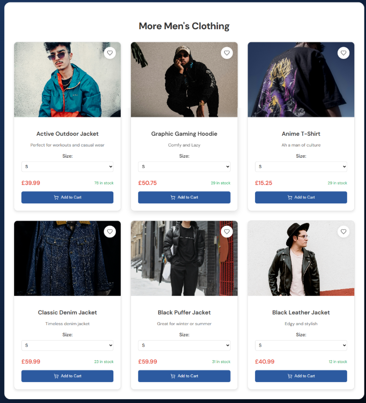
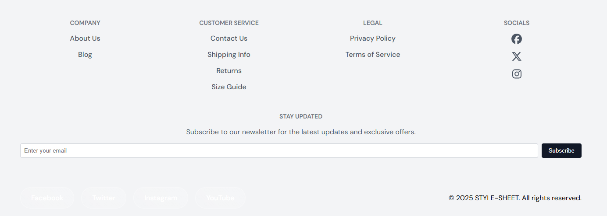

**Style-Sheet**
Front-End Plus Project 3(Final):- E-commerce site with (mimic of popular site Uniqlo/END)
## **Site Preview**
### Live link
(https://leebri101.github.io/style-sheet/)
## Contents-Page:
1. [**Project-Planning**](#project-planning)
    * [**Target Audiences**](#target-audiences)
    * [**User Stories**](#user-stories)
    * [**Site Objectives**](#site-objectives)
    * [**Wire-Frames**](#wire-frames)
    * [**Reused Code**](#reused-code)
1. [**Current Features**](#current-features)
    * [**Home-Page:**](#home-page)
        * [*Logo*](#logo-icon)
        * [*Landing-Page(Home-page)*](#landing-pagehome-page)
        * [*Pages*](#pages)
    * [**Shopping-Cart:**](#shopping-cart)
    * [**Wishlist**](#wishlist-page)
    * [**Footer**](#footer)
    * [**Typesetting**](#typesetting)
1. [**Potential-Features**](#future-enhancements)
1. [**Testing Phase**](#testing-phase)
1. [**Deployment**](#deployment)
1. [**Credits**](#credits)
    * [**Honorable mentions**](#honorable-mentions)
    * [**General reference:**](#general-reference)
    * [**Content**](#content)
    * [**Media**](#media)

## **Project Planning**
### **Target Audiences:**
* For users who want to be able purchase items off a makeshift fashion website.
* For users who want to look new fashionable items of clothing.
* For users who want to be able to take inspiration in creating their own E-commerce business.

### **Site Objectives:**
* Allowing users to easily interact with the page without any technical or difficult complications. 
* To create a simple, effective and user-friendly page which anyone can use or take inspiration from.

### **User Stories:**
* As a user I want to be able to navigate the site with ease.
* As a user I want to purchase/save/store items with ease.
* As the owner I want to be able to see a simple but smooth transition with a minimalistic look to  
* As the owner I want to be able to allow users to feel comfortable with interacting with the simple commands. 
* As the owner i want to be able to manually input products at ease.
* As the owner i want to be able to maintain the site with a minimalistic look to it.

### **Wire-Frames/Planning:**
* To prevent any digressions towards the project aims & objectives I have made a basic but extensive wire-frame via [Figma](https://www.figma.com/board/vHAspXeCOVMmQAK0wSd84j/StyleSheet?node-id=0-1&t=wVfkPLIDmJAOUdCn-1) to refer back to in case of any major changes to the project. 
* [Wireframes](docs/wireframes) were all designed in Figma for a standard structure and guidelines for main design. 
    * [Checkout-Page](docs/wireframes/checkout-popup.png)
    * [Filter-Options](docs/wireframes/filter-options.png)
    * [Home-Page](docs/wireframes/home-page.png)
    * [Kids-Page](docs/wireframes/kids-page.png)
    * [Login-Page](docs/wireframes/login-page_create-acc.png)
    * [Mens-Page](docs/wireframes/mens-page.png)
    * [Payment-Confirm](docs/wireframes/payment-confirm.png)
    * [Registration-Page](docs/wireframes/registration-page.png)
    * [Womens-page](docs/wireframes/womens-page.png)

* A Git hub project board was also made in place of digression.

[Project-Board](https://github.com/users/leebri101/projects/13/views/1)

There have been some considerable cosmetic changes to the site to improve the UX, however most of design was kept to original plan on the wire-frames. Some of these changes may include some of these features will be explained in the [**Potential-Features**](#future-enhancements) section:-
* Slight changes in the overall design for simplicity
* To not include the filter option due to the scale and time frame of the project.
* A payment system. 

### **Reused Code:**
* Some of the code that has been used in this project have been re-used from the previous projects due to the simple and effective structure it has on the layout of the final design.
    * All links have the same hover-over effect at which it changes color and size upon hovering.
    * Once clicked it will change color. 
        * Reused root structure code for simplicity of selecting the same colors.
        
***
### **Current Features**
####  **Home-Page:**
* The home-page will have multiple unique features which the user can do upon navigating which will contain these most notable features:

### *Logo-Icon*
* The Title will include some unique features:-
    * The main logo on the site will act as an anchor to return back to the main home-page.

### *Landing-Page(Home-page)*
* Hover-over cards at which users can interact with , which instantly grabs the users attention.
 
    * One for each respected category for the site
    * animation on the coming soon area/cards
    * and an interactive Navigation bar which then takes the user into 3 separate pages of mens/womens/kids clothing.

* Mobile version of home page with title, icon, buttons and web-links.
* below is a short video to show case the home-page on a mobile version. <video controls src="docs/assets/mobile/mobile-home-page.mp4" title="Home-page"></video>

### **Pages**
* The initial structure will consist of 3 pages will consistent of these 3 things in that feature the page:
    * The hero image for the page 
    
    * An interactive carousel with products.
    
    <video controls src="docs/assets/screenshots/mens-carousel.mp4" title="Mens-Carousel"></video>
    * An extra product grid for more items.  
    

* All product can be saved onto a wishlist with the heart icon which you'll have to manually go to wishlist page, which you can view the items and remove. With the same functionality of the cart page at which you can add more items or reduce, with the inclusion of selecting sizes for the products.  

 * Shopping cart demo <video controls src="docs/assets/mobile/mobile-shopping-cart-page.mp4" title="Title"></video> 

 * Wishlist demo <video controls src="docs/assets/screenshots/wishlist-page-demo.mp4" title="Title"></video>
    
***
### **Shopping Cart:**
 * Below is a short video which showcases the functionality of the cart page of being able to:
    * Add more items which changes the amount for the total cart.
    * Add and remove items in the page.
    * To continue shopping which will redirect teh user to the home-page.
        * Shopping Cart Demo:-
        <video controls src="docs/assets/screenshots/cart-page-demo.mp4" title="Title"></video>

### **Wishlist-Page:**
* The wishlist page is a similar concept of functionality with adding items to the page, removing them but adding them straight to the cart as well. a video demo will be shown to showcase the features:
    * Wishlist Demo:-
    <video controls src="docs/assets/screenshots/wishlist-page-demo.mp4" title="Title"></video>
*** 
### **Footer:**
The footer consists of a simple minimalistic look of social media links and generic information which you can find at the bottom of the page (please not that all of the links besides from the social media links are just for display purposes)
* These are the features that have been used in the footer:
    * All the icons that were used in the project have been sourced by through Font Awesome. 
    * A personal copyright has been added in-case of plagiarism.

## **Typesetting**
 Throughout the Project Portfolio only two fonts was used throughout for consistency:
  * DM Sans:- For the minimalistic simple text font. 

  * Montserrat:- Similar to DM Sans but slightly sharper but clean. 

* Please note that all fonts that have used in the project have been sourced from Google Fonts (quoted in the credits).

## **Potential-Features**
* Potential features at that i would want to implement in the near future if the opportunity were to come if i were to enhance this project or to create an entire new one would be include:  
    * Add in a voice ai chat functionality (would need to learn how to comfortably implement backend APIs)
        * AI chat bot functionality  
    * a full payment system with gift card and voucher options as payment methods
    * Newsletter and subscription based letters
    * Different languages for a broader audience

## **Testing-Phase**
Full details of the testing phase can be found here: [TESTING.md](TESTING.md)

## **Deployment**
The project has been deployed with the following steps:-

1. Within the project's [repository](), you select the **Settings** tab.
2. Then select the **Pages** menu tab on the left side.
3. Under **Source** then, select the **Main** branch from the drop-down menu and click **Save**.
4. A message will then pop up that the project has been successfully deployed with a live link.

You can visit the live link via this URL or on the top the README file- [STYLE-SHEET](https://leebri101.github.io/style-sheet/)

## **Credits**
### **Honorable mentions**
3 years of many ups and downs on this coding journey, and from this i have a very love hate relationship coding in general but it was an enjoyable journey, from constant crashes of broken code, mental and physical burnout,  to the satisfaction of seeing the planning phase to the end product. Not to mention the difficult time of coding and also juggling a new role (which i have left recently) to focus on the task at hand.
Honestly it has been a great journey to go on I have learnt a lot over the years from being conscious about the look and functionality, to being a better developer of having the end user in mind. As this is only the beginning of my path to becoming a Front-end-web Developer , there will be many more great things to come so keep an eye out on [my github page](https://github.com/leebri101) for more to come. 
But alas this is my final project which i am very satisfied to say for the end results but due to time constraints and of sheer stress experienced in the previous IT role for the project, a "majority" of the project is finished at a satisfactory level, personally if there was more flexibility I would definitely enhance this further but i must give an shout-out to the following people. (Note there will be a few bugs here and there but it will be noted on TESTING.md file)

 * [John Lamontagne](https://github.com/john-lamontagne) my previous coding mentor who is amazing at giving me advice, tips & tricks for always improving my projects, not only on a curricular base level, but in a real life perspective too. I am sad that i will not be able to have a chat with you and showcase my final project due to you not being with the company anymore, but i honestly wish you all the best in your endeavors in what you do and hopefully we meet someday, and i personally want to thank you for you guidance. 

 * [Nathan Ouriach](https://github.com/nouriach) although we have had intermittent meetings due to clashes in both our schedules, I would like to first congratulate you on becoming a dad, and to thank for keeping me level heading and helping me along the way. Although it was a brief interaction, it has taught me a lot to stay focused on the bigger picture and to not be over ambitious in the project (or in future ones too!). 

 * The Learning People for the assistance and allowing me to partake in this great course (will definitely send people along the way shout out to the team/Theo Hall)

### **General reference:**
* The project theme was based around an an idea to mimic a copy of a famous fashion brand of [Uniqlo](https://www.uniqlo.com/uk/en/) and [END](https://www.endclothing.com/gb), both are notorious for their fashion pieces, to then make an E-commerce site of my own to give off the minimalistic but effective look to the site, a majority of the design ideas was taken from the respected companies as i personally liked how responsive and clean both sites functioned.

* I have used [Medium](https://murthy-suhas.medium.com/building-a-demo-e-commerce-application-using-react-js-a39494a10e9b) for most of the understanding and structure of the project itself and to understand how to implement the API calling and placement to visually understand how to construct the project. As well as understanding and enhancing parts of the project through different components such as the shopping cart functionality ([Cart pt-1](https://medium.com/@ayabellazreg/make-a-simple-shopping-cart-app-using-react-redux-1-3-fefde93e80c7) [Cart pt-2](https://medium.com/@ayabellazreg/make-a-simple-shopping-cart-app-using-react-redux-part-2-88117cf1c069)). however most of the basic understanding of how project was looking at online tutorials and further enhancing the base code.

* [Redux-toolkit](https://redux-toolkit.js.org/) for the basic reference guide on how to utilize redux functionality in the project. 

### **Content:**
* All icons that were used throughout the project are sourced from [Font-Awesome](https://fontawesome.com/)
* All fonts used have been imported from - [Google-Fonts](https://fonts.google.com/)
* All icons mainly used in the project were sourced from [Lucide](https://lucide.dev/)
* [Fake Store.API](https://fakestoreapi.com/) API usage for project

### **Media:**
* General usage of UI [Chakra-UI](https://v2.chakra-ui.com/)
* Pallette color scheme for visual design [Loopple](https://www.loopple.com/color-palette-generator#)
* For general color scheme for project [Palette Maker](https://palettemaker.com/app)
* Color picker site [Image Color Picker](https://imagecolorpicker.com/)
* General name searching for colors[Dopely Colors](https://colors.dopely.top/color-pedia/D9885E)
* For the basic and simple wire-frame design as a professional and practical project planning platform [Figma](https://www.figma.com/?fuid=).
* Quick mass image converter [JPG Converter](https://jpgconverter.com/jpg-to-png).
* Image compressor [CompressPNG](https://compresspng.com/). 
* Alternative image compressor [iloveimg](https://www.iloveimg.com/)
* Background 
Images/ images used in project [Unsplash](https://unsplash.com/photos/stainless-steel-cooking-pots-on-stove-0EkWTSFXwCc)

