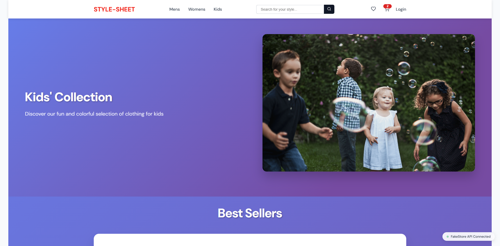

# Testing Page of Contents
* [**Development Testing Phase**](#development-testing-phase)
    * [**Manual Testing Phase**](#manual-testing-phase)
    * [**Known Issues and Solutions and Bugs**](#known-issues-and-solutions-and-bugs)
* [**Post Development Testing-Phase**](#post-development-testing-phase)
  * [**Validator Testing**](#validator-testing)
    * [**HTML**](#html---httpsvalidatorw3orgnu)
    * [**CSS**](#css---httpsjigsaww3orgcss-validator)
    * [**JavaScript**](#javascript---httpsjshintcom)
  * [**Lighthouse Scoring**](#lighthouse-scoring)

## **Development Testing Phase**
During development phase of the E-commerce project, constant manual testing has been performed:-
    
1. Firstly by publishing the page via GitHub and sharing it with friends and family to test different outcomes and functions within a set controlled environment so that I can see and experiment with the different outcomes, and receive feedback on major and small changes that needed to be rectified.

1. Secondly, continuous self testing the site to ensure that "I" as the creator/owner know what to expect of the site.

### **Manual Testing Phase**
* During the testing phase, I used three different browsers to ensure consistency & cross-platform connectivity. The browsers used in the tests are:

  1. Chrome
  2. Opera GX
  3. Edge
  

* Google Chrome:

No Known issues have been founded running smoothly on Chrome.

* Opera GX:

No Known issues have been founded running smoothly on Opera-GX.

* Microsoft Edge:

No Known issues have been founded running smoothly on Edge.

### **Known Issues and Solutions and Bugs**
* There is only a tiny amount of cosmetic issues which do not hinder the main functionality of the E-commerce site but these will be noted down in their respected numbers for easier understanding. 

* Known Issues:
  * Not being able to fully search for any item on the search bar
  
    
  * Not being able to fully view a singular item at a larger version.
  

  * Unusable checkout button
  

* Solutions: 
  * To invest in time to find a way to link it to all manual products in the project. 

  * To iterate most of the known issue will need some time and manual testing to fix these issues. and research of successful copies of E-commerce sites.
   

* Bugs: 
  * No Bugs have been found when testing.
     
    
## **Post Development Testing Phase**
### **Validator Testing**
 * As i am unsure of how to do validator testing on this particular project there shall be no results available as i was not shown how to validate the code besides of the static validators. 
 

### **Lighthouse Scoring**
### **Testing Conditions:**
* All of the pages used on the site were tested on the mobile and desktop version to ensure a high score for [Lighthouse testing](https://pagespeed.web.dev/). 

* But i have also asked a small group of people to run the project on their respected devices, desktop running at optimum 95%-100% as well as on mobile. 

#### **Desktop Version:**
* Desktop Home-Page 

* Desktop Kids

* Desktop Mens

* Desktop Womens

* Desktop Login

* Desktop Register

* Desktop Reset

* Desktop Cart 

* Desktop Wishlist

#### **Mobile Version:**
* Mobile Cart

* Mobile Reset

* Mobile Register

* Mobile Login

* Mobile Womens 

* Mobile Mens

* Mobile Wishlist

* Mobile Kids

* Mobile Home-Page

[Go back to README.md](README.md)